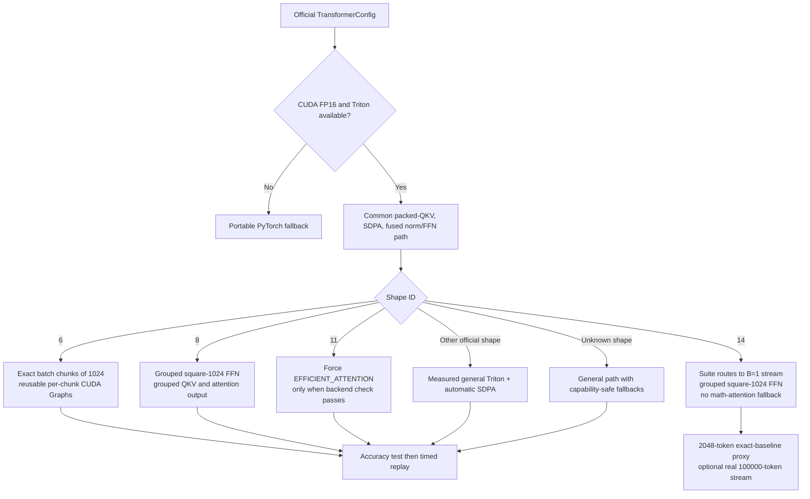

# Shape-Aware GPU Transformer Benchmark

This project optimizes Transformer inference for the 14 causal input shapes
supplied for TikTok TechJam 2026 Question 3. It compares an intentionally
explicit PyTorch reference (`BaselineTransformer`) with a hardware-aware
implementation (`UserOptimizedTransformer`) while preserving the benchmark's
elementwise accuracy rule.

The main design decision is that there is no single fastest kernel for every
shape. Small matrices are often limited by launch overhead, wide matrices are
limited by tensor-core throughput, unusual head geometries change the best
attention backend, and the two extreme cases require memory-aware execution.
The implementation therefore keeps one safe general path and adds narrowly
measured dispatch for shapes 6, 8, 11, and 14.

## Test it yourself

After completing the setup below and activating `.venv`, run the benchmark
suite from the project directory:

```powershell
python benchmark_shape_suite.py --quick --cases all
```

This is the recommended entry point for testing the project. It benchmarks
shapes 1-13 against the exact baseline and runs the safe bounded proxy for
shape 14. To test selected cases, replace `all` with a range or comma-separated
list, such as `--cases 1-6` or `--cases 6,8,14`.

## Latest result

On the test laptop described below, the latest complete quick sweep produced a
**7.451x geometric-mean speedup (+645.1% throughput)** across shapes 1-13. All
13 directly comparable cases passed accuracy. Shape 14 was validated through a
bounded exact-baseline proxy and a real 100,000-token streamed execution, but is
not included in that geometric mean because its full explicit baseline cannot
fit in 6 GiB of VRAM.

These are steady-state inference results, not first-run latency. Random-data
generation, Triton compilation, CUDA Graph capture, and setup are excluded from
the timed region.

## Baseline and optimized computation

### Reference baseline

Each baseline pre-norm Transformer block computes:

1. LayerNorm in FP32.
2. Three independent Q, K, and V projections.
3. Explicit attention scores `Q @ K^T`, scaling, a causal mask, FP32 softmax,
   and `P @ V`.
4. An attention output projection and residual addition.
5. A second LayerNorm, FFN input projection, exact GELU, FFN output projection,
   and residual addition.

This path is readable and numerically stable, but it launches many kernels and
materializes both `[B, H, S, S]` scores and probabilities. It is a reference
implementation, not a highly optimized production baseline.

### Common optimized path

The optimized model applies the following transformations before any
shape-specific choice:

- **Mixed precision:** GEMMs and attention use FP16 on the RTX 3060, while the
  residual stream and normalization reductions retain FP32 where it matters.
- **Packed QKV:** the three projection weights are packed once and checked
  against parameter versions, turning three projections into one larger
  projection.
- **Scaled dot-product attention:** PyTorch SDPA selects a fused or
  memory-efficient backend instead of explicitly storing both score and
  probability matrices.
- **Fused residual + LayerNorm:** Triton combines the residual addition and the
  following normalization, emits FP16 directly for the next GEMM, and avoids
  redundant full-activation reads and writes.
- **Fused FFN input + GELU:** a Triton GEMM computes the bias and tanh-GELU
  epilogue before writing the activation.
- **Inference parameter caches:** converted and transposed weights are cached
  with parameter-version checks.
- **CUDA Graph replay:** fixed-input benchmarks replay captured GPU work to
  reduce Python and driver launch overhead. Dynamic or mutated inputs safely
  fall back to eager execution.
- **Portable fallbacks:** CPU, unsupported CUDA devices, unavailable Triton
  kernels, and unsupported SDPA backends retain PyTorch implementations.

The memory-efficient attention path reduces intermediate memory, but it does
not remove attention's `O(S^2)` arithmetic. This distinction is especially
important for shape 14.

## Accuracy and timing contract

The optimized output passes only when every element satisfies:

```text
absolute_error <= 0.002
OR
absolute_error <= 0.02 * abs(reference)
```

This is deliberately implemented as an OR condition rather than
`torch.isclose`, whose combined tolerance is slightly more permissive. Large
reported relative errors can occur when the reference is almost zero; the
failed-element count is the deciding result.

Both models receive identical copied weights and seeded inputs. CUDA latency is
measured with CUDA events, medians are reported, and measurement order
alternates between baseline and optimized models to reduce clock and thermal
ordering bias.

Speedup and rate gain are reported as:

```text
speedup = baseline_median_ms / optimized_median_ms
throughput_gain_percent = (speedup - 1) * 100
```

## Official shapes

All supplied cases are causal. `D` is the QKV/model dimension and `F` is the
FFN dimension.

| ID | Batch | Sequence | D | Heads | F | Layers |
|---:|---:|---:|---:|---:|---:|---:|
| 1 | 64 | 128 | 128 | 4 | 128 | 4 |
| 2 | 1 | 128 | 128 | 4 | 128 | 4 |
| 3 | 4 | 128 | 128 | 4 | 128 | 4 |
| 4 | 16 | 128 | 128 | 4 | 128 | 4 |
| 5 | 128 | 128 | 128 | 4 | 128 | 4 |
| 6 | 10,000 | 128 | 128 | 4 | 128 | 4 |
| 7 | 64 | 128 | 32 | 4 | 32 | 4 |
| 8 | 64 | 128 | 1,024 | 4 | 1,024 | 4 |
| 9 | 64 | 128 | 128 | 1 | 128 | 4 |
| 10 | 64 | 128 | 128 | 2 | 128 | 4 |
| 11 | 64 | 128 | 128 | 16 | 128 | 4 |
| 12 | 64 | 32 | 128 | 4 | 128 | 4 |
| 13 | 64 | 1,024 | 128 | 4 | 128 | 4 |
| 14 | 32 | 100,000 | 1,024 | 16 | 1,024 | 2 |

The canonical table lives in `OFFICIAL_BENCHMARK_SHAPES`; the single-case and
suite runners import the same mapping so they cannot silently drift apart.

## Shape decision tree



Shape-tuned grouped kernels are additionally gated to NVIDIA compute capability
8.6, the target RTX 3060 Laptop GPU. Other GPUs fall back rather than assuming
that this laptop's tile choices are universally optimal.

## Per-shape decisions and measured results

The table below is from the latest `--quick --cases all` sweep. Quick mode uses
one accuracy trial, three warmups, ten repeats, and one timing round per case;
use the full command later in this README for submission-quality measurements.
Thermal and clock variance is most visible in the very short cases.

| ID | Selected strategy | Baseline ms | Optimized ms | Speedup |
|---:|---|---:|---:|---:|
| 1 | General Triton + automatic SDPA | 6.4174 | 1.1121 | 5.771x |
| 2 | Same path; CUDA Graph removes a large launch floor | 2.0961 | 0.1198 | 17.496x |
| 3 | Same path; small batch remains launch-sensitive | 2.4561 | 0.1710 | 14.363x |
| 4 | Same path; full exact computation | 2.9133 | 0.3405 | 8.556x |
| 5 | General path; current one-warp narrow norm retained | 12.6531 | 2.1161 | 5.979x |
| 6 | Exact batch-1024 chunks + reusable chunk graphs | 658.8651 | 127.6268 | 5.162x |
| 7 | Generic fused Triton retained for `32 -> 32` FFN | 5.0028 | 0.5161 | 9.693x |
| 8 | Grouped FFN, packed QKV, and attention output | 47.8976 | 14.3913 | 3.328x |
| 9 | Automatic SDPA/native projections retained | 3.7775 | 1.1069 | 3.413x |
| 10 | Automatic SDPA/native projections retained | 4.9551 | 1.0429 | 4.751x |
| 11 | Forced memory-efficient SDPA for head dimension 8 | 15.0292 | 1.6348 | 9.193x |
| 12 | General path; short sequence is launch-sensitive | 2.1243 | 0.3456 | 6.147x |
| 13 | Automatic SDPA already chooses the best backend | 209.8278 | 10.8867 | 19.274x |
| 14 | Real `B=1, S=100000` stream; no fitting explicit baseline | N/A | 2,118.5/sample | N/A |

The varied speedups are expected. Shape 8 performs much more `D^2` GEMM work
and becomes compute-bound even after fusion. Shape 9 has only one head, so the
explicit baseline is already relatively fast and leaves less removable
overhead. Conversely, shapes 2 and 3 are dominated by launch overhead in the
baseline, while shape 13 benefits enormously from avoiding explicit large
attention intermediates. A lower speedup does not necessarily mean a broken
optimized path; it can mean the baseline is already closer to the hardware
floor for that geometry.

### Why the generic small-width FFN was retained

A direct microbenchmark initially suggested replacing the generic Triton FFN
with `torch._addmm_activation` for small dimensions. Full-model, sufficiently
warmed CUDA Graph tests reversed that conclusion:

| Case | Current Triton ms | Native fused ms | Native effect |
|---|---:|---:|---:|
| Shape 7 (`D=32`) | 0.3809 | 0.4035 | 5.6% slower |
| Shape 1 (`D=128`) | 0.9718 | 1.0895 | 10.8% slower |
| Shape 13 (`D=128`) | 10.8124 | 11.6111 | 6.9% slower |

This is why shapes 1-7 and 9-13 normally retain the autotuned
FP32-accumulation Triton FFN instead of dispatching to a native small-matrix
path.

### Attention backend evidence

- Shape 11's unusual `16 heads x head_dim 8` geometry measured 1.3885 ms with
  automatic SDPA, 1.3773 ms with `EFFICIENT_ATTENTION`, and 1.7162 ms with
  cuDNN. The efficient backend is therefore forced only after a runtime support
  check.
- Shape 13 measured 10.6926 ms automatic, 10.6941 ms efficient, and 11.5948 ms
  cuDNN. Automatic selection was already optimal, so no special dispatch was
  added.
- Shapes 9 and 10 gained only about 0.4% and 0.2% from forcing the efficient
  backend, below the threshold for a robust shape-specific change. cuDNN was
  slower, particularly for shape 10.
- This Windows PyTorch build was not compiled with PyTorch's Flash Attention
  backend. Long attention therefore uses the memory-efficient backend (with a
  cuDNN fused fallback where supported) and explicitly excludes the OOM-prone
  math fallback. The strategy follows FlashAttention's tiled, non-materialized
  principle, but the backend on this machine is not `FLASH_ATTENTION`.

### Shape 8: wide square projections

Shape 8 was dominated by GEMMs: its `D=1024` projections require roughly 64
times the multiply-accumulate work of a `D=128` square projection for the same
number of rows. The final implementation uses short FP16 tensor-core partials
and promotes every 32-wide reduction group into an FP32 accumulator. This is
faster than full FP32 accumulation while remaining inside the benchmark's
accuracy rule.

Measured progression:

| Shape-8 implementation | Optimized median |
|---|---:|
| Previous generic optimized path | 18.58 ms |
| Grouped square-1024 FFN input/output | 16.93 ms |
| Plus grouped packed QKV and attention output | 14.29 ms |

The final five-trial validation had zero failures across 41,943,040 output
elements. A more aggressive 64-wide accumulation group produced four failures
and was rejected even though it could have looked attractive in a latency-only
test.

### Shape 6: exact large-batch chunking

Shape 6 has a normal sequence length but a batch of 10,000. Attention and every
other layer operate independently across batch elements, so splitting only the
batch dimension is mathematically exact: no token can attend to a token in
another batch item.

The runner allocates the full output, processes bounded slices, and copies each
slice into its final position. One CUDA Graph is reused for full-size chunks
and another for the final remainder. This bounds intermediate memory without
changing the model or returning a proxy.

| Chunk size | Full `B=10000` latency | Peak reserved VRAM |
|---:|---:|---:|
| 256 | 140.810 ms | 2.668 GiB |
| 512 | 129.217 ms | 2.842 GiB |
| 1,024 | **127.571 ms** | **3.465 GiB** |

All three candidates were bit-identical across 163,840,000 outputs and had the
same output SHA-256. Chunk 1,024 was selected because it gave 10.4% more
throughput than 256 while retaining more than 1.5 GiB of headroom under the
5 GiB tuning cap. The suite's conservative preflight estimate is 2.83 GiB.

### Shape 14: real computation under a 6 GiB limit

Shape 14 is the streamed case; shape 4 is a normal exact case and is not
streamed.

An FP32 shape-14 input or output alone is approximately 12.21 GiB. One explicit
FP32 `[B, H, S, S]` attention matrix would be approximately 18.63 TiB, and the
baseline's scores plus probabilities would require roughly 37.25 TiB before
other activations. The exact full-batch API and explicit baseline therefore
cannot run on a 6 GiB laptop GPU.

The safe strategy is:

1. Never construct a dense 100,000-by-100,000 causal mask; SDPA receives
   `is_causal=True`.
2. For sequences of at least 8,192 tokens, permit only memory-efficient or
   cuDNN fused SDPA backends, never the materializing math fallback.
3. Keep the official model configuration so the shape-14 grouped square-1024
   FFN dispatch remains active.
4. Execute one real `[1, 100000, 1024]` sample at a time and repeat up to 32
   samples. Intermediate outputs are overwritten; the final output is checked
   for finiteness and contributes a checksum.
5. Before allocating, compare a conservative estimate with free VRAM and the
   configured memory fraction. Abort safely on an insufficient budget or OOM.
6. Compare the same optimized kernels against the explicit baseline at a safe
   proxy sequence length of 2,048.

This is real full-sequence Transformer computation for every streamed sample;
it is not a fake FLOP loop. It is not equivalent to returning the complete
official `[32, 100000, 1024]` tensor, however. The current runner also reuses one
seeded sample for repeated streamed samples and retains only the final output
checksum.

The latest real one-sample run completed in 2,118.5 ms with 2.75 GiB peak
allocated and 2.96 GiB peak reserved VRAM. A previously completed 32-sample
stream took about 68.96 seconds. The bounded 2,048-token proxy passed with zero
failures. Grouped FFN kernels improved a real sample by about 3.5%; grouped
attention projections added only about 0.5% and were not kept for shape 14.

## Tested laptop and benchmark settings

The repository was tuned on the following machine:

| Component | Recorded value |
|---|---|
| Laptop | Lenovo Legion 5 15IAH7H, machine type 82RB |
| CPU | Intel Core i5-12500H, 16 logical processors |
| System memory | 15.73 GiB usable (16 GB class) |
| GPU | NVIDIA GeForce RTX 3060 Laptop GPU, 6,144 MiB |
| Compute capability | 8.6 |
| NVIDIA driver | 616.56 |
| Driver CUDA support | CUDA 13.4 reported by `nvidia-smi` |
| PyTorch CUDA runtime | CUDA 13.0 |
| OS | Windows NT build 10.0.26200 as reported by Python |
| Python | 3.11.3, 64-bit |
| PyTorch | 2.13.0+cu130 |
| Triton module | 3.7.1 |
| Windows Triton package | `triton-windows==3.7.1.post27` |
| Active power plan | `Legion Performance Mode` |
| GPU power ceiling | 140 W current ceiling; 80 W default reported by driver |

The laptop was switched to performance mode and the GPU was overclocked before
the final optimization runs. At the environment capture, `nvidia-smi` reported
a 7,201 MHz memory clock and a 2,100 MHz maximum SM clock. The exact core and
memory offset values were not saved, so they should not be presented as fully
reproducible settings. Record the utility, offsets, voltage/power policy, fan
mode, ambient temperature, and sustained clocks before a final submission run.

Recommended conditions for comparable results:

- Connect AC power and confirm `powercfg /getactivescheme` reports the intended
  performance plan.
- Select the discrete NVIDIA GPU/high-performance application profile.
- Use the same NVIDIA driver, Python, PyTorch, CUDA wheel, and Triton versions.
- Close GPU-accelerated browsers, games, overlays, and background workloads.
- Use the same fan/performance mode and give the laptop unobstructed airflow;
  raising the rear or using a cooling pad can improve sustained clocks.
- Run warmups before collecting data and let temperatures stabilize between
  competing configurations.
- Apply overclocks conservatively. An unstable overclock can create incorrect
  results, driver resets, or misleading latency even when a short test passes.

Performance mode and overclocking affect absolute latency; they do not replace
the code optimizations. Both baseline and optimized models must be measured
under the same power and thermal state for a fair ratio.

## Setup and installation

### Prerequisites

- 64-bit Windows with a CUDA-capable NVIDIA GPU.
- A compatible NVIDIA driver (`nvidia-smi` must work).
- Python 3.11 is recommended for the tested package combination.
- Git and PowerShell.

The official [PyTorch installation selector](https://pytorch.org/get-started/locally/)
should be used when adapting the project to a different driver or CUDA wheel.

### Recommended isolated `.venv`

From PowerShell:

```powershell
git clone https://github.com/gwenlim89/GPU-kernel-for-transformer.git
cd GPU-kernel-for-transformer

py -3.11 -m venv .venv
Set-ExecutionPolicy -Scope Process Bypass
.\.venv\Scripts\Activate.ps1

python -m pip install --upgrade pip setuptools wheel
python -m pip install torch==2.13.0 --index-url https://download.pytorch.org/whl/cu130
python -m pip install -r requirements-optimization.txt
```

`requirements-optimization.txt` installs `triton-windows` on Windows and the
corresponding Triton range on non-Windows systems. It intentionally does not
install PyTorch, because the original test environment reused a preinstalled
CUDA-enabled PyTorch build.

### Recreate the current system-site-packages layout

The checked local `.venv/pyvenv.cfg` was created with
`include-system-site-packages = true`. To reproduce that layout, first install
the tested PyTorch wheel into the Python 3.11 base environment, then create the
environment as follows:

```powershell
py -3.11 -m pip install torch==2.13.0 --index-url https://download.pytorch.org/whl/cu130
py -3.11 -m venv --system-site-packages .venv
.\.venv\Scripts\Activate.ps1
python -m pip install -r requirements-optimization.txt
```

The isolated setup is easier to reproduce and is recommended for new machines.
Do not copy `.venv` between computers; recreate it. The environment and Triton
cache directories are already excluded by `.gitignore`.

### Verify the environment

```powershell
python -c "import torch, triton; print('torch', torch.__version__); print('triton', triton.__version__); print('cuda', torch.version.cuda); print('available', torch.cuda.is_available()); print('gpu', torch.cuda.get_device_name(0)); print('capability', torch.cuda.get_device_capability(0))"
nvidia-smi
powercfg /getactivescheme
```

Expected key values on the tuned laptop are `torch 2.13.0+cu130`, `triton
3.7.1`, `available True`, an RTX 3060 Laptop GPU, and capability `(8, 6)`.

The first Triton run compiles kernels into `.kernel_cache/triton` and will be
slower. Benchmark warmups keep compilation outside the reported latency.

## Reproducing the results

All commands below assume the virtual environment is activated. If activation
is unavailable, replace `python` with `.\.venv\Scripts\python.exe`.

### List the canonical shapes

```powershell
python torch_transformer_benchmark.py --list-shapes
```

### Quick smoke test for every shape

```powershell
python benchmark_shape_suite.py --quick --cases all
```

This runs exact comparisons for shapes 1-13 and the bounded shape-14 proxy.
Shape 14 is reported as `PROXY`, not silently counted as a full pass.

### Submission-quality run for shapes 1-13

```powershell
python benchmark_shape_suite.py --cases 1-13 `
  --accuracy-trials 5 `
  --warmup 20 `
  --repeats 100 `
  --benchmark-rounds 3
```

### Run one shape directly

```powershell
python torch_transformer_benchmark.py --shape-id 8 `
  --accuracy-trials 5 `
  --warmup 20 `
  --repeats 100 `
  --benchmark-rounds 3
```

The output prints the resolved `optimized_shape_plan`, accuracy summary,
baseline and optimized latency, tokens per second, speedup, and throughput
gain.

### Shape 6 with its default safe chunk

```powershell
python torch_transformer_benchmark.py --shape-id 6 `
  --accuracy-trials 1 `
  --warmup 5 `
  --repeats 10 `
  --benchmark-rounds 3
```

Shape 6 automatically selects batch chunks of 1,024. Use
`--batch-chunk-size 0` only if the full unchunked allocation is known to fit;
disabling the guard can OOM this laptop.

### Shape 14 bounded proxy

```powershell
python streamed_shape14.py --proxy-seq-len 2048 --warmup 1 --repeats 3
```

### Shape 14 real 100,000-token stream

Start with one real sample:

```powershell
python streamed_shape14.py --full --samples 1 --warmup 1 --repeats 1
```

Then run all 32 streamed samples only after confirming memory and thermals:

```powershell
python streamed_shape14.py --full --samples 32 --warmup 1 --repeats 1
```

Alternatively, route it through the suite:

```powershell
python benchmark_shape_suite.py --quick --cases 14 `
  --run-full-shape14 --shape14-samples 32
```

### Regression suite

```powershell
python validate_transformer.py --quick
```

This covers the default CUDA path, causal attention, a padding mask, native
CUDA fallbacks, and the CPU fallback.

### CUDA profiling

```powershell
python profile_transformer.py --warmup 10 --iterations 20 --rows 25
```

An optional Chrome trace can be written with `--trace transformer_trace.json`.

## Project files

| File | Purpose |
|---|---|
| `torch_transformer_benchmark.py` | Baseline, optimized model, official shapes, accuracy, timing, and shape dispatch |
| `triton_fused_ffn.py` | Generic and shape-tuned FFN/QKV Triton kernels |
| `triton_fused_norm.py` | LayerNorm and fused residual-LayerNorm kernels |
| `cuda_graph_runner.py` | Validated fixed-input CUDA Graph capture and replay |
| `batch_chunk_runner.py` | Exact bounded-memory batch execution and per-chunk graphs |
| `benchmark_shape_suite.py` | Isolated 14-shape runner, preflight estimates, and summary |
| `streamed_shape14.py` | Safe proxy and real long-sequence streaming for shape 14 |
| `validate_transformer.py` | Cross-path correctness and fallback regression suite |
| `profile_transformer.py` | PyTorch CUDA profiler helper |
| `requirements-optimization.txt` | Platform-specific Triton dependency |

## Limitations

### Code and benchmark limitations

- The custom kernels are inference-only and do not implement backward passes.
- The fastest specializations are measured for SM 8.6 and exact official
  families. Unknown shapes and other GPUs use fallbacks, but have not received
  the same tuning depth.
- CUDA Graph results describe repeated fixed-shape inference. First-call JIT,
  graph capture, changing input objects, and dynamic serving behavior can have
  different latency.
- The explicit baseline is deliberately simple. Reported speedups should not be
  interpreted as speedups over an already optimized FlashAttention or
  TensorRT-style baseline.
- Accuracy is empirical across seeded random inputs under the supplied
  tolerance, not a proof for every possible input distribution. Larger input
  scales, modified weights, NaNs, or unstable overclocks require retesting.
- Padded causal attention above sequence length 4,096 is rejected because the
  current combined padding/causal mask would be dense. Shape 14's supported
  path is all-valid causal attention.
- Some code relies on current PyTorch behavior and an internal fused primitive;
  upgrading PyTorch, CUDA, Triton, or the driver can change kernel selection,
  compilation, accuracy, and timing.
- Parameter conversion/transposition caches consume additional memory and are
  intended for stable inference weights.
- Shape 14 does real work but does not return 32 distinct full outputs. It
  streams one deterministic sample repeatedly and records a checksum, so it is
  a hardware-feasibility runner rather than a drop-in full-batch API.
- The full shape-14 explicit baseline is impossible on this GPU, so there is no
  direct baseline speedup number for that official case.

### Hardware limitations

- Six GiB of VRAM constrains batch and long-sequence validation even when the
  optimized attention kernel itself is memory efficient.
- Laptop cooling and shared CPU/GPU heat capacity limit sustained clocks. Shape
  14 is long enough for thermal and power behavior to matter much more than in
  a short shape-2 test.
- Dynamic voltage/frequency scaling, fan curves, ambient temperature, display
  activity, background applications, and the GPU power ceiling all affect
  repeatability.
- Overclock offsets were not logged in the repository and may not be stable on
  another nominally identical RTX 3060 Laptop GPU.
- The power plan and 140 W ceiling are laptop-specific; systems with a lower
  TGP will have different absolute performance and possibly different optimal
  chunk or tile choices.

## What could be improved with more time

- **Run the true shape-14 reference elsewhere.** A 48-80 GiB GPU could
  hold the full input/output for a complete optimized batch, but even it
  cannot materialize the current baseline's roughly 37.25 TiB of scores and
  probabilities. An exact blockwise/distributed reference or carefully
  designed CPU/offload implementation is required to obtain a meaningful full
  shape-14 baseline time for 32 distinct inputs.
- **Return a semantically complete shape-14 result.** Stream distinct samples
  from host memory, write each output to host or disk, and validate the full
  batch rather than reusing one sample and retaining only a checksum.
- **Use a build with Flash Attention support.** Compare PyTorch Flash,
  memory-efficient CUTLASS, cuDNN, and external kernels on the exact long
  geometry instead of relying on the available Windows backends.
- **Fuse more of shape 8.** Residual/norm-to-projection fusion, cuBLASLt
  epilogues, or a persistent multi-operation block kernel could reduce the
  remaining memory traffic. Shape 8 and shape 9 are the only latest quick-sweep
  cases below 4x.
- **Autotune per GPU rather than hard-code SM 8.6 choices.** Persist the winning
  tile, warp, accumulation-group, attention backend, and shape-6 chunk after a
  guarded accuracy/performance search.
- **Improve dynamic-mask support.** Add a bounded block-sparse or fused causal +
  padding path for long padded sequences.
- **Broaden correctness testing.** Add adversarial input scales, more seeds,
  non-identity LayerNorm affine parameters, parameter mutation, odd sequence
  lengths, and long-running overclock stability tests.
- **Measure energy and thermal behavior.** Log sustained clocks, power,
  temperature, fan mode, and confidence intervals alongside latency. A
  lower-power kernel may be preferable even when two candidates have similar
  median latency.
- **Lock the complete environment.** Add a fully pinned requirements/lock file
  and an automated `torch.utils.collect_env` artifact so that future runs do
  not depend on system-site packages.
